# Matthew Kelam T2A2 - Marketplace Project

## gfurn

[Website](https://gfurn.herokuapp.com/)

[Github](https://github.com/maaronkel/gfurn)

## **Introduction**

I wanted to create an app similar to [Grailed](http://grailed.com), a peer to peer marketplace where users can sell and buy second hand menswear; clothing, shoes and jewelery from (mostly) designer brands. My take on this application is exclusively for second hand pieces of houseware from designer/luxury brands, such as rare / vintage and contemporary furniture, lighting, accessories etc, that are difficult to find elsewhere - especially in Australia. I've never bought expensive furniture before, however I do have a keen interest in anything archticture, interior and industrial design, and wanted to create a niche marketplace app somewhat blending all three.

### **Problem**

There isn't a platform where you can easily find these certain items online. You'll be extremely lucky to find something on a site like eBay, so my app will simplify the process for those with an interest in unique contemporary or vintage furniture and houseware.

Therefore, those that don't want to spend hundreds on importing fees alone when importing an item from overseas from unreliable and unrecognisable websites, my app will help make it more accessible for buyers and sellers in this niche market in Australia.

## **Description**

#### **Purpose**

The mission of this marketplace is to bridge the gap between people who want to part with a rare or unique piece of furniture or any other houseware including lighting and accessories, and an interested buyer.

#### **Functionality / Features**

Ability for Users to create an account, log in, add information like their name and email to their account, list items for sale, add information and images to their listings, as well as purchase an item from another seller. Users are restricted to only being able to view all the listings on the homepage and listings page, yet need to log in or create an account to both shop and sell.

#### **Sitemap**

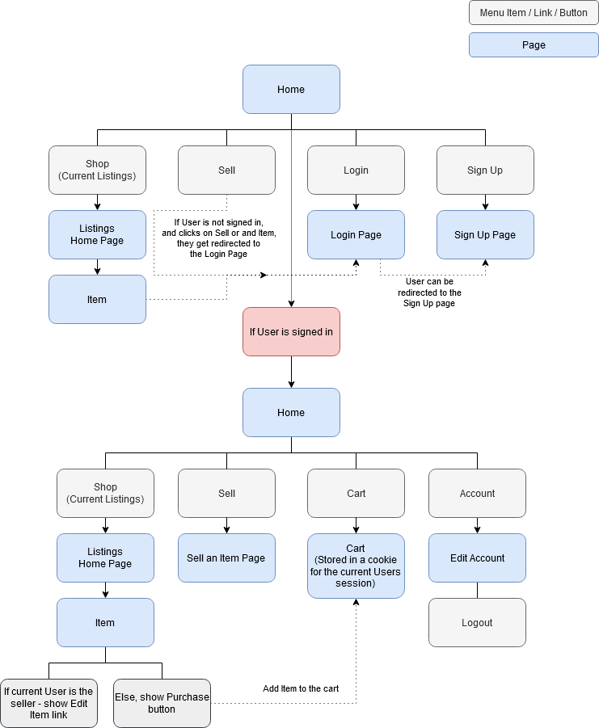

#### **Screenshots**

Homepage
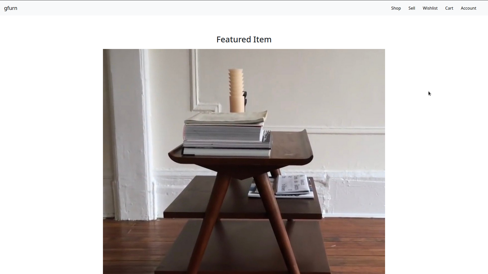

Items Page
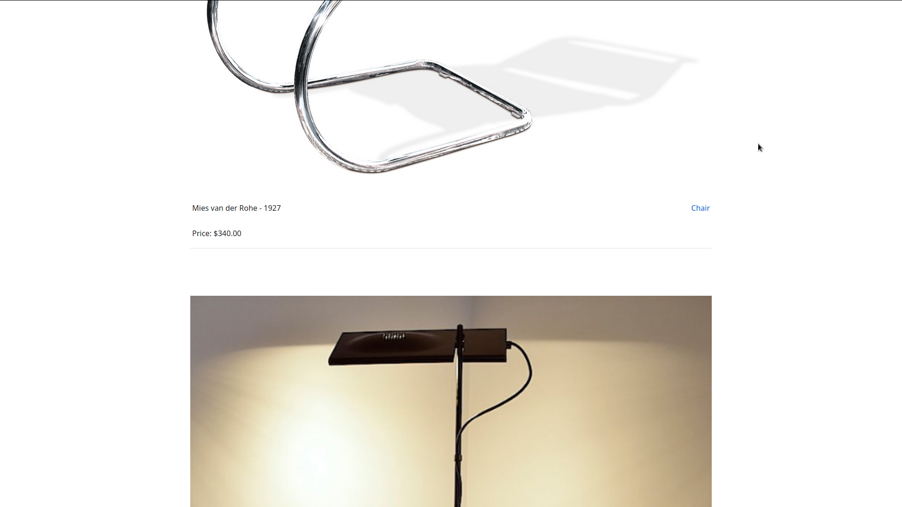

Item Page (Buyer)
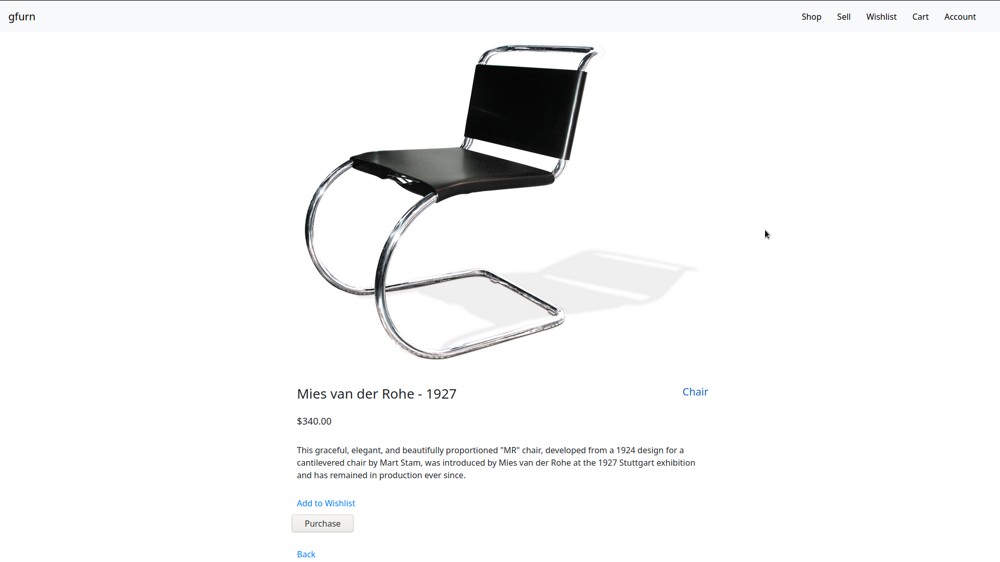

Item Page (Seller)
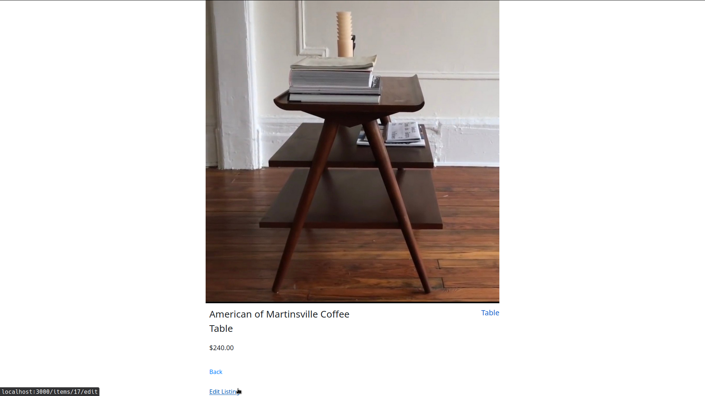

Sell an Item
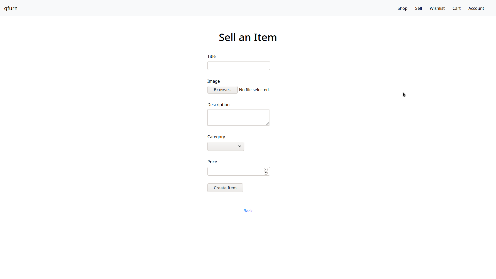

Wishlist
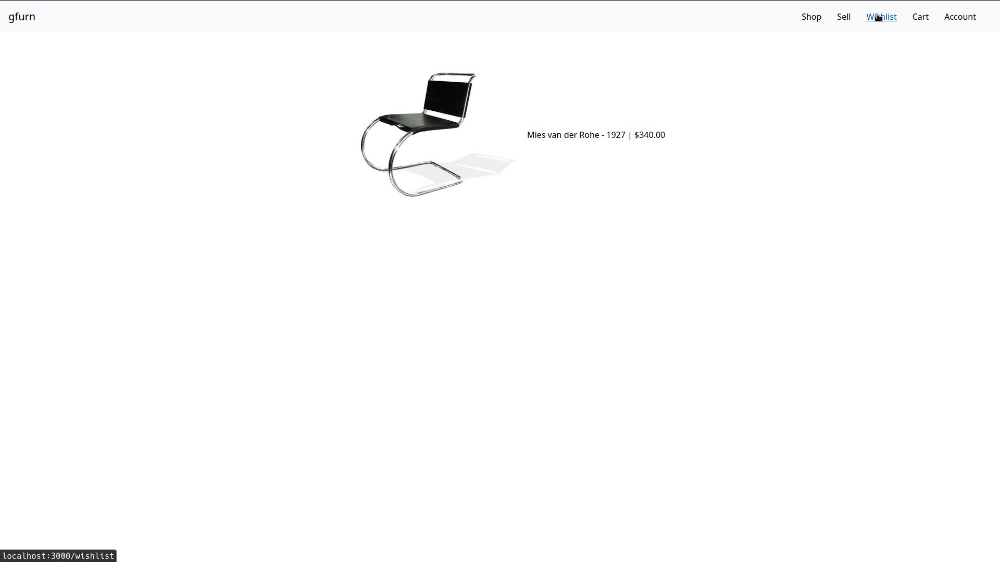

Cart
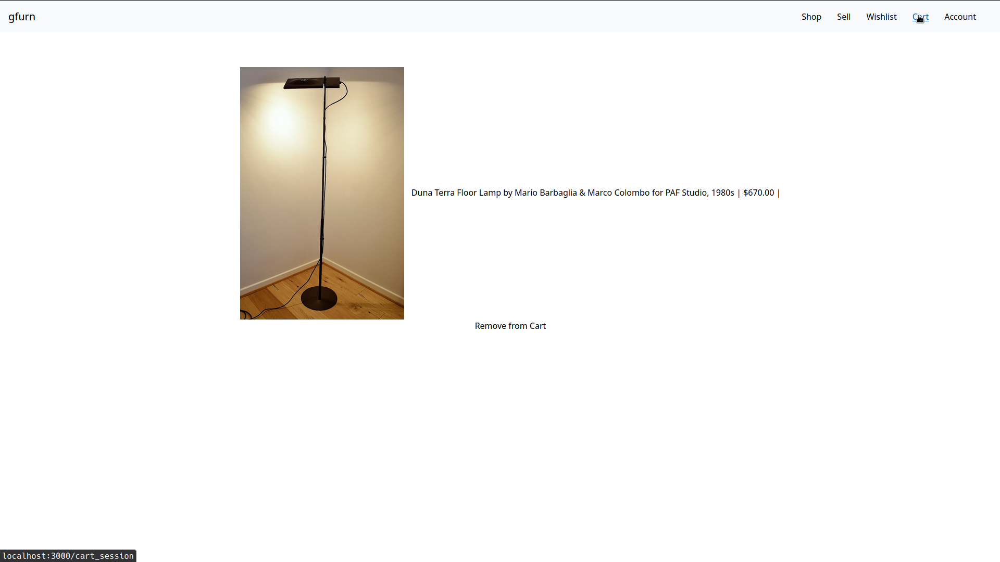

Edit Account
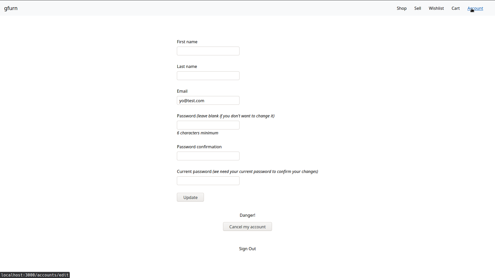

#### **Target audience**

Individuals with an interest in unique, rare and vintage furniture and houseware. Or maybe someone who's rich and wants to splash a lot of money on a chair.

#### **Tech stack**

- Front-end: HTML5, CSS3, SCSS, Bootstrap, Ruby, ERB, JavaScript
- Back-end: Ruby 2.7.1, Ruby on Rails 6.0.3.2
- Database: Postgresql
- Deployment: Heroku
- Utilities: Stripe, Devise
- DevOps: Git, Github, vim, VS Code, Bundler, diagrams.net, dbdesigner.net

## **User stories for your app**

- As someone interested in Furniture and Houseware by Industrial Designers, I want to view other people listings.
- As someone interested in reselling furniture for higher prices, I want a dedicated marketplace where I can find buyers.
- As someone who finds an Item I like, I want to add that Item to my wishlist so I can save that piece of furniture or houseware for later, while I decide if it's the right purchase.
- As someone who wants to purchase multiple items, I want to be able to store the furniture and houseware I want to buy inside a cart, so I dont have to buy them separately.
- As a potential User, I want to sign up with my email address.
- As a potential User, I want to view the listings currently available without registering, so I can determine if I want to sign up and potentially buy or sell Items.
- As a User selling and Item, I dont want another Account having access to Edit or Delete my Item.

## **Wireframes for your app**

Desktop | Tablet | Mobile

Homepage
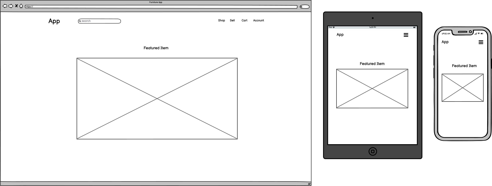

Items Page
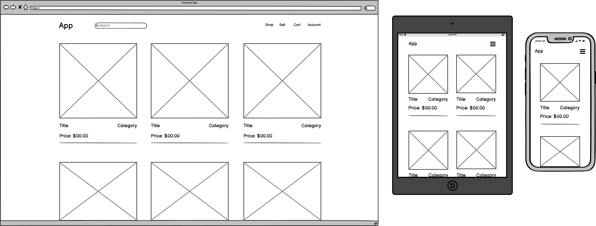

Item Page (Buyer)
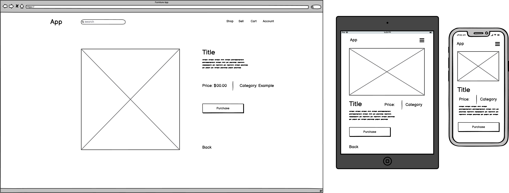

Item Page (Seller)

Sell an Item
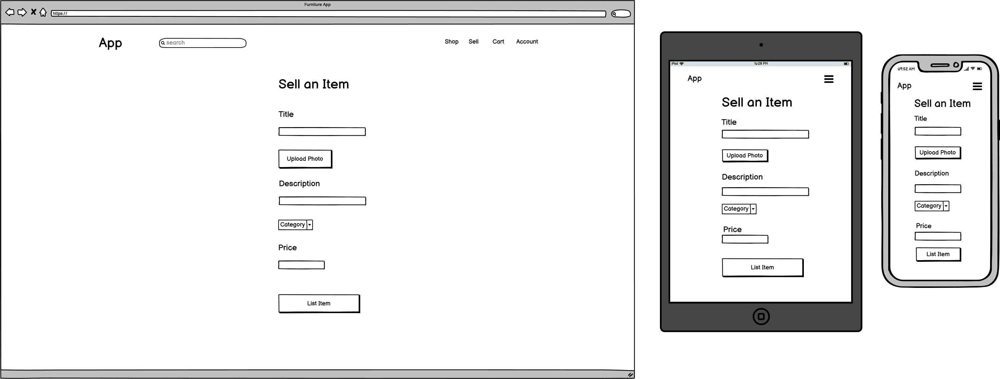

Edit Item
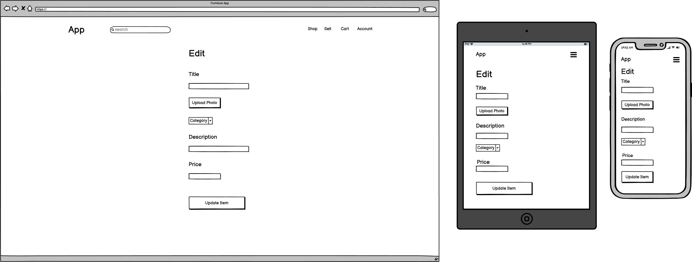

Cart, Top: Cart = Full, Bottom: Cart = Empty
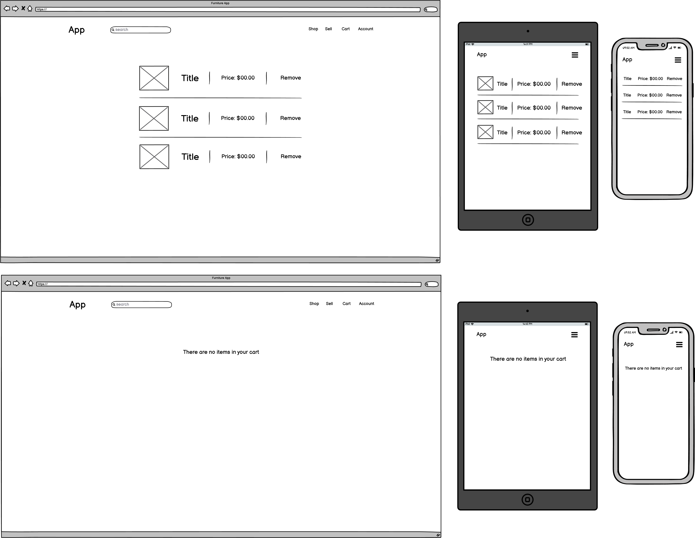

Account Page
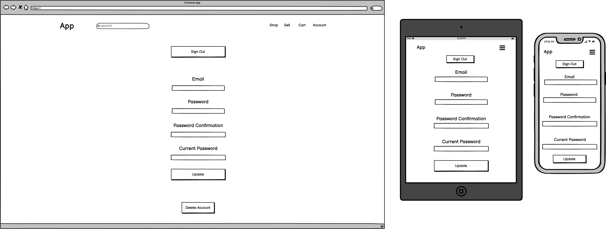

Log In Page

Sign Up Page

## **An ERD for your app**

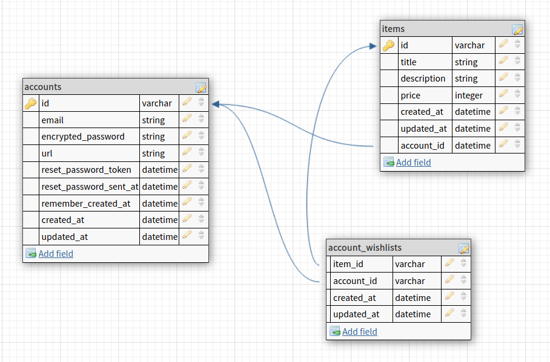

## **Explain the different high-level components (abstractions) in your app**

The high level components in my app are:

Accounts: Users have to register for an account if they want to buy and/or sell an item of furniture or housewear. They can sign up with their email and input their first and last names. Unregistered Users can still browse the app, but cannot go further than the listings page, where they are allowed to see each listing so far.

Wishlist and Cart: Users with an Account can add items to their Wishlist to save an item for later. They can add any Items to their cart, though it is based on their current session through a cookie, so the cart doesnt get saved if they log in through another device.

Items: A User with an Account can easily post and Item, inputing the price, category and a photo. The newest listing posted on the app will be on the Homepage, as a "featured" Item, until another Account posts and Item.

## **Detail any third party services that your app will use**

- Bootstrap

Bootstrap-sass a ruby gem that is a SASS version of the CSS framework Bootstrap. It is a free and open source framework for components like navigation and forms. I used the template components for the forms and navbar, yet manually did the rest of the styling using SCSS for everything else on the app.

- Devise

Devise is another ruby gem that is a session-based flexible authentication solution for Rails. My app uses devise as authorization and authentication, where an Account is only allowed to edit their own Items they've posted, can only buy other Accounts Items, and Users not signed in have limited access to the app. Apon registration, users can create an account with their email, and passwords are automatically encrypted inside the database.

- Heroku

I have deployed this app on Heroku, which is a service that enables developers to build, run, and operate applications entirely in the cloud.

## **Describe your projects models in terms of the relationships (active record associations) they have with each other**

An Account

- has_many items, an item belongs_to an account
- has_many :account_wishlist, an Account Wishlist belongs_to :account

An Item

- belongs_to account, an account has_many items
- has_one_attached image

An Account Wishlist (Items added to an Accounts Wishlist)

- belongs_to :account, an has_many Account Wishlists
- belongs_to :item

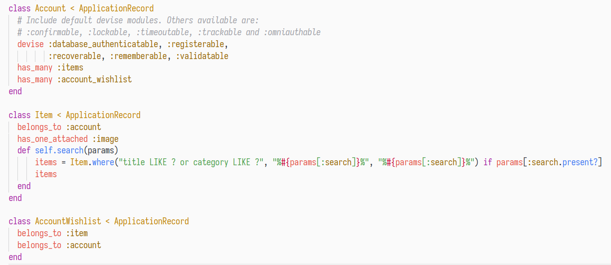

## **Discuss the database relations to be implemented in your application**

In the ERD above, the database tables are accounts, items and a join table account_wishlists, linking to the accounts tables id and the items tables id with foreign keys. The account table has a one to many relationship with the the items table, such as an account can has 0 or many items for sale, and 0 or many items in their cart. The accounts table also has a 0 or many relationsip with account_wishlists, as an account can again have 0 or many items in their wishlist

## **Provide your database schema design**

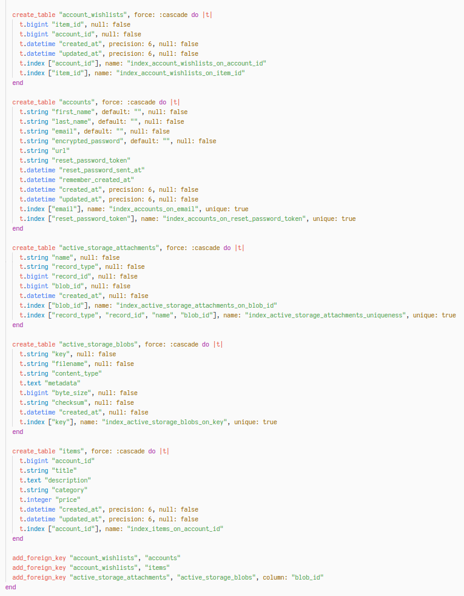

## **Describe the way tasks are allocated and tracked in your project**

I have used Trello to organise my project. My lists consist of "Rubric" (Listing the criteria), "Code" (all the requirements on the code rubric), "Docs" (listing what I have to do for this README), "Slide Deck" (presentation requirements), "Doing" and "Done".

I have labelled all cards in each list, the items that are compulsory have "required" along with either !, !! or !!!, depending on their importance and the order of completion. After finishing a task, its moved to the "Done" list and given another label indicating its finished, so it's out of sight, out of mind, and enabling me to focus and the next tasks ahead.

This is a screenshot of my Trello board near completion of the assignment.

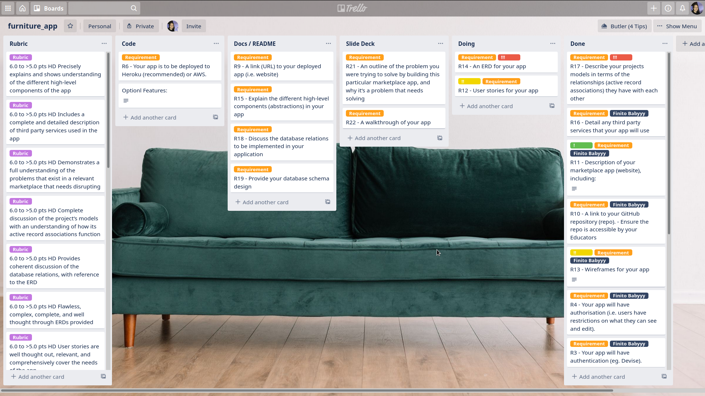
